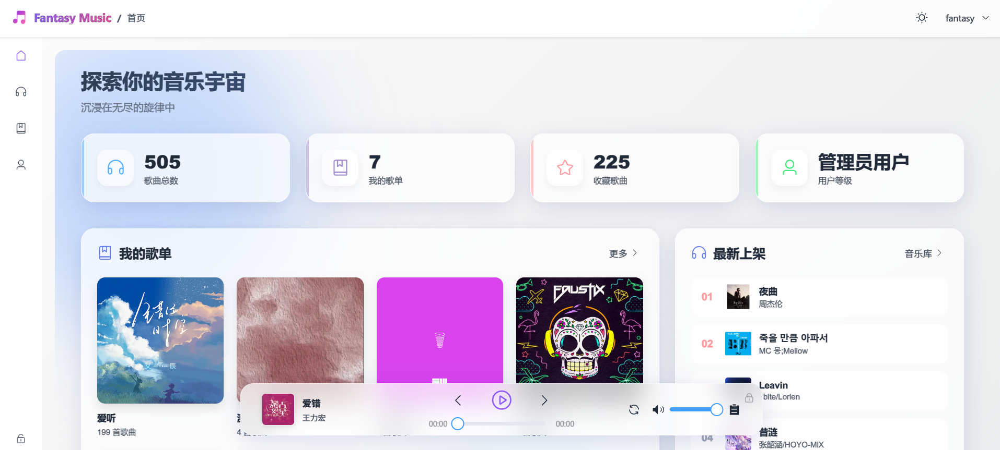
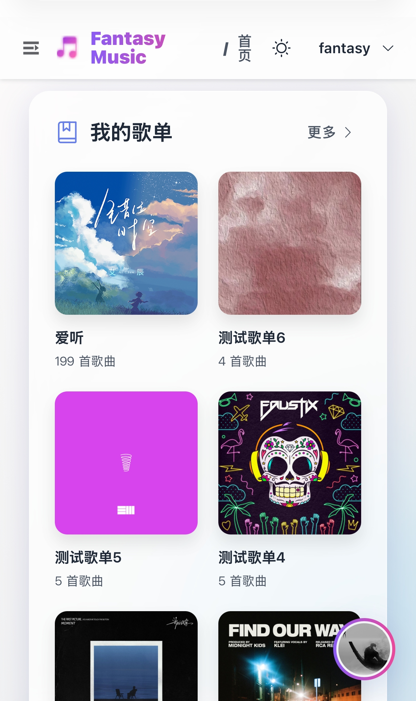

# FantasyMusic-web

FantasyMusic-web 是一个基于 **Vue 3** 和 **Vite** 构建的现代音乐平台的前端 UI 项目。它提供了相对时尚的玻璃拟态用户界面和流畅的交互体验，包含持久化音乐播放器、歌单管理以及用户认证等页面的前端实现。

**注意**：本项目仅包含前端页面代码，需配合后端的 Spring Boot 服务才能完整运行。

后端项目地址：[FantasyMusic](https://github.com/ReReverie/FantasyMusic)

## 功能特性

- **现代 UI 设计**：玻璃拟态效果（Glassmorphism），响应式布局，以及暗黑模式适配。
- **音乐播放器**：
  - 底部持久化播放器，包含播放控制（播放、暂停、上一首、下一首）。
  - 播放模式支持：顺序播放、列表循环、单曲循环、随机播放。
  - 播放列表管理和音量控制。
- **音乐库**：浏览和管理您的音乐收藏。
- **歌单管理**：创建和管理个人歌单。
- **用户账户**：
  - 安全的登录和注册功能。
  - 个人资料管理（头像、昵称、邮箱）。
  - 修改密码功能。
- **文件上传**：支持音乐文件上传。
- **安全性**：基于 Token 的身份验证 (JWT)，安全的路由重定向和注销处理。

## 技术栈

- **前端框架**: [Vue 3](https://vuejs.org/)
- **构建工具**: [Vite](https://vitejs.dev/)
- **UI 组件库**: [Element Plus](https://element-plus.org/)
- **状态管理**: [Pinia](https://pinia.vuejs.org/)
- **路由管理**: [Vue Router](https://router.vuejs.org/)
- **HTTP 客户端**: [Axios](https://axios-http.com/)
- **CSS 预处理器**: [Sass](https://sass-lang.com/)
- **工具库**: `jsencrypt`, `spark-md5`, `nprogress`

## 项目结构

```
FantasyMusic-web/
├── public/              # 静态资源
├── src/
│   ├── api/             # API 请求模块
│   ├── assets/          # 项目资源 (图片, svg)
│   ├── components/      # 全局组件
│   ├── layout/          # 布局组件 (侧边栏, 头部, 底部播放器)
│   ├── router/          # Vue Router 路由配置
│   ├── store/           # Pinia 状态管理模块
│   ├── utils/           # 工具函数
│   ├── views/           # 页面视图
│   ├── App.vue          # 主应用组件
│   └── main.js          # 应用入口文件
├── .gitignore           # Git 忽略规则
├── index.html           # HTML 入口文件
├── package.json         # 项目依赖和脚本
├── vite.config.js       # Vite 配置文件
└── README.md            # 项目文档
```

## 快速开始

### 环境要求

- [Node.js](https://nodejs.org/) (推荐使用 LTS 版本)
- [npm](https://www.npmjs.com/) 或 [yarn](https://yarnpkg.com/)

### 前置步骤

请使用OpenSSL或者ssh-keygen生成对应的密钥对

以下是OpenSSL步骤

```bash
# 生成 2048 位私钥（PEM）
openssl genpkey -algorithm RSA -pkeyopt rsa_keygen_bits:2048 -out private_key.pem
```

> 请保留当前私钥,后续用于服务端

从私钥导出公钥

```bash
openssl pkey -in private_key.pem -pubout -out public_key.pem
```

将生成的公钥根据**"env.example"**里的提示替换掉,并将**"env.example"**重命名为**".env"**

### RSA 公钥配置

用于前端登录密码加密，需与后端保持一致。

```env
VITE_RSA_PUBLIC_KEY="-----BEGIN PUBLIC KEY-----
YOUR_PUBLIC_KEY_HERE
-----END PUBLIC KEY-----"
```

如果未配置该环境变量，项目将使用内置的默认公钥。

### 安装步骤

1. 克隆仓库：
   ```bash
   git clone https://github.com/ReReverie/FantasyMusic-web.git
   cd FantasyMusic-web
   ```

2. 安装依赖：
   ```bash
   npm install
   ```

### 开发环境

启动开发服务器：

```bash
npm run dev
```

打开浏览器并访问 `http://localhost:5173` (或终端中显示的端口)。

### 线上环境构建

线上版本：

```bash
npm run build
```

本地预览线上构建：

```bash
npm run preview
```

## 项目截图

|             PC 端              |                        移动端                         |
| :----------------------------: | :---------------------------------------------------: |
|  |  |

## 许可证

[MIT](LICENSE) © [ReReverie](https://github.com/ReReverie)

---

**注意**: 本项目目前正处于开发阶段。